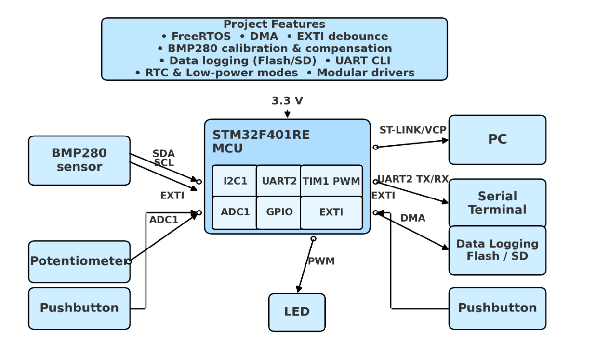

# Niloo_STM32_repo
A collection of STM32 embedded systems projects demonstrating GPIO, UART, ADC, PWM, I2C, SPI, DMA, EXTI, and FreeRTOS.

Overview
Each project demonstrates a specific STM32 feature or embedded design pattern. They are structured in folders under fw/ (firmware), named P0, P1, etc., to reflect the order and complexity of development.

<<<<<<< HEAD



## 📋 Project Task Table
| Project | Feature | Goal | Done When |
|---|---|---|---|
| P0 | GPIO + Clock Init | Blink LED @ 1 Hz | LED blinks reliably |
| P1 | UART2 Printf | PC serial I/O | “Hello, STM32” prints in terminal |
| P2 | EXTI Pushbutton + Debounce | Interrupt + debounce | Button press toggles LED once |
| P3 | TIM1 PWM → LED | Hardware PWM | LED fades smoothly |
| P4 | ADC1 Potentiometer → PWM | Analog read + LED control | Pot controls brightness |
| P5 | I2C BMP280 (WHOAMI + raw) | Basic I2C | IDs and raw values print |
| P6 | BMP280 Calibration | Engineering units | Temp/Pressure stable |
| P7 | UART Streaming | CSV/JSON logs | Log 60+ s without drop |
| P8 | UART TX via DMA | Non-blocking comms | System stays responsive |
| P9 | Data Logging (Flash/SD) | On-device storage | Records survive power cycle |
| P10 | UART CLI | Runtime control | Settings can be changed live |
| P11 | FreeRTOS Task Split | Concurrency | No task starvation |
| P12 | Low Power + RTC | Energy awareness | Sleeps + wakes reliably |
| P13 | I2C DMA | Offload reads | Minimal CPU usage |
| P14 | Watchdog + Fault Logging | Self-recovery | Resets + logs cause |
| P15 | Integrated Demo App | Interview showcase | End-to-end demo runs |

## 🧰 Tools & Environment
- **Board:** STM32F401RE Nucleo  
- **IDE:** STM32CubeIDE  
- **Framework:** STM32 HAL  
- **Interface:** ST-Link (VCP for UART)  
- **Terminal:** PuTTY / Tera Term @ 115200 8N1

## 🏁 Getting Started
```bash
git clone https://github.com/nilooeli/Niloo_STM32_repo.git
Open a project’s .ioc in STM32CubeIDE, build, flash, then view UART at 115200 8N1.

💡 Future Plans
Per-project diagrams & wiring notes

Test results and logic analyzer captures

Short blog-style notes per milestone

🙏 Acknowledgments
Thanks to STMicroelectronics and the embedded community for tools and resources.
>>>>>>> 04326b658bc8f94b98965dc5394633e3f1f02224
